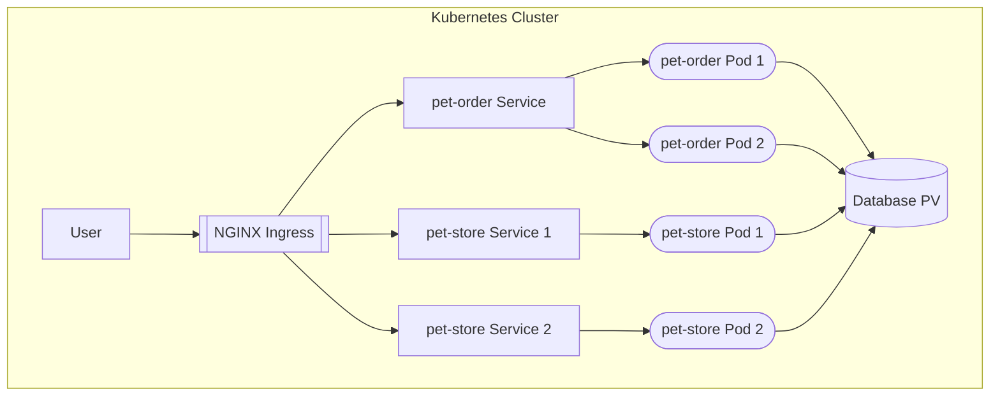

# Cloud Computing K8s Home Assignment
A home assignment for the Cloud Computing course at Reichman University.

## Introduction
In this assignment, you will explore the fundamentals of Kubernetes as covered in the lecture.
This exercise is designed to give you hands-on experience with Kubernetes, guiding you through the essential concepts and practices that underlie this powerful orchestration tool.
You will create a Kubernetes cluster and learn how to define and deploy applications within it by creating key resources like Deployments and Services.
These components will allow you to understand how Kubernetes manages application availability, scalability, and networking within a cluster.

Through this assignment, you'll gain practical insights into the structure and function of Kubernetes resources, which are essential for running and maintaining distributed applications.
By the end, you should have a foundational grasp of how to set up and manage applications in Kubernetes, preparing you for more advanced topics and real-world applications in container orchestration.  

## Prerequisites

Before continuing to the tasks, ensure the following tools are installed on your computer:

* [Git](https://git-scm.com/book/en/v2/Getting-Started-Installing-Git).
* [Docker](https://docs.docker.com/engine/install/).
* [kind](https://kind.sigs.k8s.io/docs/user/quick-start/).
* [kubectl](https://kubernetes.io/docs/tasks/tools/).

**⚠️ Note**: At the time of writing, there is an open bug in the latest version of Kind. Thus, please install version `v0.30.0` of Kind.

## Clone the Git Repository
To access the files in this repository you should first clone it to your local computer.

```shell
git clone https://github.com/yanivNaor92/cloud-computing-k8s-assignment
cd cloud-computing-k8s-assignment
``` 
Note: Make sure to run the commands in the following tasks from the root directory of this repository (unless instructed otherwise).

## Task 1 - Create a Sample Kubernetes Application
The following steps will guide you through creating the local Kubernetes cluster and deploying a sample application in the cluster.

### Step 1.1 - Create a KIND cluster
To create a Kubernetes cluster using KIND, run the following command in your terminal (make sure your Docker engine is
running first):

```shell
kind create cluster --config kind-config.yaml
```

If the installation was successful, you should see an output similar to the following:

```shell
Creating cluster "kind" ...
 ✓ Ensuring node image (kindest/node:v1.30.0) 🖼
 ✓ Preparing nodes 📦
 ✓ Writing configuration 📜
 ✓ Starting control-plane 🕹️
 ✓ Installing CNI 🔌
 ✓ Installing StorageClass 💾
Set kubectl context to "kind-kind"
You can now use your cluster with:

kubectl cluster-info --context kind-kind

Have a nice day! 👋
```

To ensure your kubectl context is pointing to your kind cluster, run the following command:

```shell
kubectl cluster-info
```

The output should be similar to the following:

```shell
Kubernetes control plane is running at https://127.0.0.1:43581
CoreDNS is running at https://127.0.0.1:43581/api/v1/namespaces/kube-system/services/kube-dns:dns/proxy

To further debug and diagnose cluster problems, use 'kubectl cluster-info dump'.
```

### Step 1.2 - Create an Image of the Sample Application
Make sure you perform the commands in this step from the `sample-app` directory.  
In your terminal run the following command to navigate to the `sample-app` directory.
```shell
cd sample-app
```
Build the Docker image and load it to the cluster:
```shell 
docker build -t ecommerce-app:latest .
kind load docker-image ecommerce-app:latest 
```

### Step 1.3 - Deploy the Sample Application
1. Deploy the `Deployment` resource:
```shell
kubectl apply -f deployment.yaml
```
2. Verify the application Pod was created successfully:
```shell
kubectl get pods
```
### Step 1.4 - Expose Your Application to Network Traffic

1. Deploy the `Service` resource:
```shell
kubectl apply -f service.yaml
```

### Step 1.5 - Verify the Application is Up and Running
Open your browser at the following address: `http://localhost:8080`.  
You should see the application running.

### Step 1.6 - Scale out your application
Currently, your Deployment is configured to create only one instance of your application.  
You can create more replicas by running the following command:
```shell
kubectl scale deployment ecommerce-app --replicas=3
```
Note that the `replicas` field of the `Deployment` resource was changed from 1 to 3.
```shell
kubectl get deployment ecommerce-app -o yaml
```
Note that the cluster now has 3 Pod replicas of the ecommerce app:
```shell
kubectl get pods
```

The `Service` resource we created in step 1.4 will ensure the traffic is evenly distributed between all the Pod replicas.  
Execute the following command in your terminal:
```shell
curl http://localhost:8080/api/podName
```
The output should be the Pod's name that handled the request.  
Execute it a few more times and observe how the response changes between each call.  

## Task 2 - Deploying a Multi-Service Application with Kubernetes
In this assignment, you will build upon your previous experience with Docker Compose by deploying the same multi-service application using Kubernetes. You will implement the Kubernetes equivalent of the architecture described in Assignment #2, ensuring high availability, scalability, and robustness of the application.  

### Objectives
#### Deploy a Multi-Service Application
Use Kubernetes to deploy the following services:
* 2 instances of the pet-store service from Assignment #1 (Each instance represents a different store).
* 2 instances of the pet-order service as described in Assignment #2 (the two instances are used for load balancing)
* 1 database service (e.g., MongoDB or another DB of your choice).
* 1 reverse-proxy service using NGINX.

#### Service Resilience
Configure the pet-store and pet-order services for persistence, ensuring data is retained in the database after a crash or restart.

#### Load Balancing
Use Kubernetes Services to load balance traffic across the replicas of the pet-order service.

#### Reverse Proxy Configuration
Configure NGINX as a reverse-proxy to route requests from outside of the cluster to the appropriate service.

### Architecture
The following diagram shows a high-level architecture of the system you need to implement.  
**Note**: This diagram is intentionally simplified. It does not represent an exhaustive list of all Kubernetes resources involved, but highlights only the main components in order to demonstrate the flow of communication between them.


### Instructions
The following sections will guide you through the required steps to complete this task.  

#### Step 2.1 - Create a KIND cluster
Create the KIND cluster as you did in [step 1.1](#step-11---create-a-kind-cluster). You can use the same cluster from task 1 or create a new one.  
```shell
kind create cluster --config kind-config.yaml
```
#### Step 2.2 - Create a Namespace in the Cluster
All Kubernetes resources you implement in this task should be in the same namespace. This namespace should **not** be the `default` namespace.  
In Kubernetes, a namespace is also considered a resource and can be described by the following manifest:
```yaml
apiVersion: v1
kind: Namespace
metadata:
  name: <namespaces-name>
```  
You should create the manifest above, replace the `<namespaces-name>` with a name of your choice, and save it in a file named `namespace.yaml`.  
To create the namespace in the cluster, run the following command:
```shell
kubectl apply -f namespace.yaml
``` 
Make sure to use the same namespace in all the resources you create in the following steps.  

#### Step 2.3 - Implement the Micro Services
The files of each micro-service of the system should be placed in a dedicated folder. In the end, your entire solution should be organized in the following structure:  
```plaintext
cloud-computing-k8s-assignment/
├── multi-service-app/
│   ├── namespace.yaml
│   ├── pet-store/
│   │   ├── deployment1.yaml
│   │   ├── deployment2.yaml
│   │   ├── service1.yaml
│   │   ├── service2.yaml
│   │   ├── ninja-api-secret.yaml
│   │   └── Dockerfile
│   │   └── Dockerfile2(optional)
│   │   └── app/
│   ├── pet-order/
│   │   ├── deployment.yaml
│   │   ├── service.yaml
│   │   └── Dockerfile
│   │   └── app/
│   ├── database/
│   │   ├── deployment.yaml
│   │   ├── service.yaml
│   │   ├── persistentVolume.yaml
│   │   ├── persistentVolumeClaim.yaml
│   ├── nginx/
│   │   ├── deployment.yaml
│   │   ├── service.yaml
│   │   ├── configmap.yaml
```
**⚠️ Notes**:
1. All file and folder names mentioned above MUST be kept as is, except for the `app` folder, which is meant to store your services' code. You are allowed to rename this folder and add additional files or folders, if needed.  
2. If your second instance of the pet-store service uses a different image than the first one, add its Dockerfile to the `Dockerfile2` file. If they use the same image, then a single file named `Dockerfile` is sufficient.
3. When the TA builds your Docker files, the used Docker context is the `multi-service-app` folder. Take that into account when creating your Docker files.    

##### Pet Store Service
This micro-service is the pet-store service you implemented in assignments #1 and #2. It has to provide the same REST API and fulfill the same requirements as instructed in assignment #1.
Similar to assignment #2, you need to run **two** replicas of the pet-store service. Each instance is independent and represents a different store.  

To implement this micro-service you need to create the following files:
* `deployment1.yaml` - YAML specification of the `Deployment` Kubernetes resource of the **first** pet store. 
* `deployment2.yaml` - YAML specification of the `Deployment` Kubernetes resource of the **second** pet store. 
* `service1.yaml` - YAML specification of the `Service` Kubernetes resource that expose the pods of the **first** pet store to network traffic.
* `service2.yaml` - YAML specification of the `Service` Kubernetes resource that expose the pods of the **second** pet store to network traffic.
* `Dockerfile` - The Dockerfile used to build the pet-store container image.
* `Dockerfile2` - (Optional) The Dockerfile used to build the second pet-store container image. This is relevant only if your second instance of the pet-store service uses a different image than the first one.  
* `app/` - A folder containing the code implementation of the pet-store container (You are allowed to rename this folder and add additional files or folders, if needed).
* `ninja-api-secret.yaml` - YAML specification of the `Secret` Kubernetes resource that stores the NINJA API key.

**⚠️ Notes**:  
* The pet-store service should use a NINJA API key. **Instead of hardcoding the API key** in your code or Dockerfile, you must store it securely in a Kubernetes Secret and reference it in your Deployments. See the [Secrets Management](#secrets) section for more information.  
* The pet-store service must not be **directly** exposed to external communication (outside of the K8s cluster).
* Both instances of the pet-store may listen to a port number of your choice.

##### Pet Order Service
This micro-service is the same pet-order service you implemented in assignment #2. It has to provide the same REST API and fulfill the same requirements as instructed in assignment #2. You need to run **two** replicas of this service.  
Keep in mind that clients calling the pet-order service should not know which instance processes their request. Responses must be consistent across all instances, and each request should be load-balanced between the two. Unlike assignment #2, the requests should be load-balanced **evenly** between the instances.

To implement this micro-service you need to create the following files:
* `deployment.yaml` - YAML specification of the `Deployment` Kubernetes resource of the pet-order. 
* `service.yaml` - YAML specification of the `Service` Kubernetes resource that exposes the pet-order pods to network traffic.
* `Dockerfile` - The Dockerfile used to build the pet-order container image.
* `app/` - A folder containing the code implementation of the pet-order container (You are allowed to rename this folder and add additional files or folders, if needed).  

**⚠️ Note**: The pet-order service must not be **directly** exposed to external communication (outside of the K8s cluster).

##### NGINX Service
This micro-service is used as a reverse proxy for accessing the internal services. (as done in assignment #2). A user from outside of the cluster interacts with this service only. The NGINX proxy should forward each request to the relevant service according to the request's path (e.g. `/purchases`, `/pet-types`, etc.).  
To implement this micro-service you need to create the following files:
* `deployment.yaml` - YAML specification of the `Deployment` Kubernetes resource that describes the nginx Pod. 
* `service.yaml` - YAML specification of the `Service` Kubernetes resource that exposes the nginx pod to **external** network traffic. Think which [Service type](https://kubernetes.io/docs/concepts/services-networking/service/#publishing-services-service-types) it needs to be. Hint: take a look at the `kind-config.yaml` file.    
* `configmap.yaml` - YAML specification of the `ConfigMap` Kubernetes resource that describes the nginx configurations.  
You can find more information about using `ConfigMap` in this [section](#config-maps).

**⚠️ Note**: The NGINX service is the single entry point to the cluster's network.  

##### Access Rights
We have 2 roles accessing the application:
* **Owner** - Identified by the header `OwnerPC: LovesPetsL2M3n4`
* **Customer** - any unauthenticated request.

**Similar** to the previous assignment, the same access rules apply for the owner and the customer regarding the API endpoints they are allowed to use.  
**Unlike** the previous assignment, direct access to the pet-store service is not allowed for either the owner or the customer.  
Instead, all incoming traffic is handled by NGINX. You may implement the access control at the NGINX level or at the service level.


##### DataBase Service
This micro-service is used to add persistence to the system.  
For each CRUD operation done by the pet store service, the data should be stored in the database. Remember that there are two independent instances of the pet store service that access the database and two instances of the pet-order service for load-balancing.  

Keep in mind that you cannot guarantee which pet-order instance handles the API request. Also, both instances may be handling requests simultaneously.  
Be aware that both instances write to the same database. You need to ensure they don't conflict with each other (For example, purchasing the same pet twice).  

To implement this micro-service you need to create the following files:
* `deployment.yaml` - YAML specification of the `Deployment` Kubernetes resource that describes the database Pod. 
* `service.yaml` - YAML specification of the `Service` Kubernetes resource that exposes the database pod to network traffic.  
* `persistentVolume.yaml` - YAML specification of the `PersistentVolume` Kubernetes resource.  
* `persistentVolumeClaim.yaml` - YAML specification of the `PersistentVolumeClaim` Kubernetes resource.  
You can find more information about `PersistentVolume` and `PersistentVolumeClaim` in this [section](#persistent-volumes).

#### Step 2.4 - Build the Docker Images and Load them Into the Cluster
After you create each service's code and Dockerfile, you should build their Docker images with the `docker build` command.  
```shell
docker build -t <image-name> -f <path-to-dockerfile> .
```
Note that the `image` field in the `Deployment` of each micro-service should match the image tag you specified when building the image.  
To avoid pushing the images to a public Docker registry such as [Docker Hub](https://hub.docker.com/), you should load the images into the cluster by running the following command:
```shell
kind load docker-image <image-name>
```
Note that for the NGINX and database (e.g. MongoDB) services, you can use a public Docker image instead of creating one yourself. You don't need to load public images into your KIND cluster manually.  
**Important**: To make K8s use the image you loaded instead of pulling it from outside of the cluster, you must specify the following field in the container template of the respective `Deployment` resource: `imagePullPolicy: IfNotPresent`.
See the example in the `sample-app/deployment.yaml` file.  

#### Step 2.5 - Deploy the Resources in the Cluster
You should use the `kubectl apply` command to deploy your resources into your cluster.  
1. Ensure you have your Kubernetes configuration file (e.g., `deployment.yaml`) ready.
2. Open your terminal.
3. Navigate to the directory containing your configuration file.
4. Ensure you are targeting your desired cluster.  
   This can be done by setting the `KUBECONFIG` environment variable to the path of the kube-config file.
   ```shell
   export KUBECONFIG="path/to/your/kubeconfig/file"
   ```
   or by placing the kube-config file in the default path: `~/.kube/config` (the `~` sign indicates the HOME directory).
5. Run the following command:
   ```shell
   kubectl apply -f deployment.yaml
   ```
   You should get a message indicating the resource was created. e.g. `deployment/ecommerce-app created`
6. Validate your resource was created as expected by running the following command:  
   ```shell
   kubectl get <resource-name> -n <resource-namespace> -o yaml 
   ``` 
After you deploy all the required resources of each microservice, proceed to the next step and test that the system is functioning as expected.  

#### Step 2.6 - Test the System Behavior
##### Verify your Components' Status 
First, you need to validate that all of your resources, especially your `Pods,` were created successfully.  
Run the following command to get all the Pods in a specific namespace (replace `<namespace>` with your namespace):
```shell
kubectl get pods -n <namespace>
``` 
The output should look as follows:
```shell
NAME                          READY   STATUS    RESTARTS   AGE
mongodb-66966bfb5-b5ftj       1/1     Running   0          30s
nginx-58b49cbdcf-hvg7z        1/1     Running   0          30s
pet-order-6dd9b58c45-8lvwt    1/1     Running   0          30s
pet-order-6dd9b58c45-95952    1/1     Running   0          30s
pet-store1-784699887f-g6blt   1/1     Running   0          30s
pet-store2-7df77f84f6-jqk9t   1/1     Running   0          30s
```
Note the `STATUS` column. If one of the `Pods` is not in the `Running` status, you should investigate what might cause it.  
You can view the Pod's definition and its `status` by running the following command:
```shell
kubectl get pods <pod-name> -n <namespace> -o yaml
```
The `status` section usually contains useful information about the Pod's health and the error description (if it exists).  
If the Pod's container prints any logs, you can view them by running the following command:
```shell
kubectl logs <pod-name> -n <namespace> -c <container-name>
```

##### Use the REST API
The REST API should be available for use at the address `http://127.0.0.1:80/`, which corresponds to the NGINX service.  
The NGINX should function as a reverse proxy and forward the request to the relevant service according to the request path. For example, a request to `http://127.0.0.1:80/pet-types1` should be forwarded to the first `pet-store` service.  
The services (pet-store and pet-order) should serve the same paths and HTTP methods as specified in assignments #1 and #2.  

##### Validate Data Persistency
As mentioned in the [DataBase Service](#database-service) section, the database service should store its data persistently on the host machine (the Node).  
To validate that, perform the following steps:
1. Use the REST API to create data in the system (for example, use the POST `/pet-types` endpoint).  
2. Run the following command to get the database's Pod name:
   ```shell
   kubectl get pods -n <namespace-name>
   ```
   You should see a list of all the pods, copy the name of your database Pod.
3. Delete the database Pod by running the following command:
   ```shell
   kubectl delete pod <pod-name> -n <namespace-name>
   ```
4. Ensure a new database Pod was created and it's in the `Running` status:
   ```shell
   kubectl get pods -n <namespace-name>
   ```
5. Use the REST API to ensure the data you created in step 1 still exists.  


### Submission
* Submit a zip file containing all code, Dockerfiles and YAML manifests as mentioned in [step 2.3](#step-23---implement-the-micro-services).
* Make sure your NINJA API key is included in the pet-store service.  
* If submitting the work as a team, please attach a document listing the team members.

#### Test your Submission
To run a basic sanity test of your work before submitting it, you should run the shell script in this repository.  
The script ensures your files and folder structure are in the correct form as described in [step 2.3](#step-23---implement-the-micro-services).  
The script performs the following actions:
1. Creates a KIND cluster (the cluster is created with the name `test-submission`. Don't forget to delete it afterwards).  
2. Build the Docker images of the `pet-store` and `pet-order` deployments. The tag of those images is extracted from the respective `deployment.yaml` file.  
3. Deploy the K8s resources of each of the services into the created cluster.  
4. Wait for all the Pods to reach the `Running` state.  
5. Perform an HTTP request using the `curl` command to ensure the services are responsive.  

Before running the test script, ensure that the `multi-service-app` folder, containing your submission is in the same folder as the test script.  
Also, the `yq` command should be installed on your computer. You can download it from [here](https://github.com/mikefarah/yq/#install) (install v4.x of yq).  
To run the script run the following command from your terminal:
```shell
bash test-submission.sh
```
The script may accept two **optional** arguments:
```shell
bash test-submission.sh --timeout 300 --skip-create-cluster
```
* `timeout`:  the number of seconds to wait until all Pods become running (default is 300).  
* `skip-create-cluster`: skips the creation of the K8s cluster. This is useful if the script failed in the middle and you want to rerun it without creating the cluster again.  

If everything works as expected, the script should complete without any errors, and the following messages should appear:  
```text
The sanity test for http://localhost:80/pet-types1 passed successfully.
The sanity test for http://localhost:80/pet-types2 passed successfully.
The sanity test for http://localhost/transactions passed successfully.
```

## Clean up
To delete the kind cluster you created in this assignment run the following command:
```shell
kind delete cluster --name <cluster-name>
```
To get the list of KIND clusters and to ensure the cluster is deleted, run the following command:
```shell
kind get clusters
```

# Appendices
## How to Access a Service in a Kubernetes Cluster
When Pods within the same cluster need to communicate with each other, Kubernetes Services provide a stable endpoint.  
Assume a Service named `my-service` in the `default` namespace exposing port 80.  
A client can use the Service name (`my-service`) as the DNS hostname.  
Kubernetes’ internal DNS will resolve `my-service` to its cluster IP.  
Thus, a Pod in the same namespace as the Service can execute HTTP requests to the Service by using just its name. e.g. `curl http://my-service:80`.

However, if the Pod is in a different namespace than the Service, it must use its full name: `<service-name>.<namespace>.svc.cluster.local`.  
Assume a Service named `my-service` exists in the namespace `app-namespace`. A Pod in the `default` namespace can access the Service using: `curl http://my-service.app-namespace.svc.cluster.local:80`.  

## Secrets
A `Secret` in Kubernetes is an API object used to store sensitive information such as passwords, API keys, tokens, and certificates. Secrets are similar to ConfigMaps but are specifically designed for confidential data. Kubernetes provides several built-in protections for Secrets, such as only sending them to nodes that need them and storing them in memory rather than on disk.  
With `Secret` we can store sensitive data securely and avoid hardcoding credentials in application code or container images.  
More information about `Secret` can be found in Kubernetes [official documentation](https://kubernetes.io/docs/concepts/configuration/secret/).

### Creating a Secret
There are several ways to create a Secret in Kubernetes, here we will specify how to create them from YAML files.   
Create a file with base64-encoded values:
```yaml
apiVersion: v1
kind: Secret
metadata:
  name: my-secret
  namespace: my-namespace
type: Opaque
data:
  username: YWRtaW4=        # base64 encoded "admin"
  password: bXlwYXNzd29yZDEyMw==  # base64 encoded "mypassword123"
```

To encode values in base64:
```shell
echo -n 'admin' | base64
```

### Using Secrets in Pods
Secrets can be consumed by Pods as environment variables or mounted as files.

**Option 1: As Environment Variables**
```yaml
apiVersion: v1
kind: Pod
metadata:
  name: my-pod
  namespace: my-namespace
spec:
  containers:
  - name: my-container
    image: my-image
    env:
    - name: USERNAME
      valueFrom:
        secretKeyRef:
          name: my-secret
          key: username
    - name: PASSWORD
      valueFrom:
        secretKeyRef:
          name: my-secret
          key: password
```

**Option 2: As Mounted Volumes**
```yaml
apiVersion: v1
kind: Pod
metadata:
  name: my-pod
  namespace: my-namespace
spec:
  containers:
  - name: my-container
    image: my-image
    volumeMounts:
    - name: secret-volume
      mountPath: /etc/secrets
      readOnly: true
  volumes:
  - name: secret-volume
    secret:
      secretName: my-secret
```

When mounted as a volume, each key in the Secret becomes a file in the specified directory. For example, `/etc/secrets/username` and `/etc/secrets/password` would contain the respective values.  

Note that the `Secret` and consuming resources (Pods, Deployments, etc.) must be in the same namespace.

## Config Maps
A `ConfigMap` in Kubernetes is an API object used to store non-confidential configuration data in key-value pairs. ConfigMaps decouple configuration artifacts from application code, enabling you to manage application settings separately from the container images.  
With `ConfigMap` we can configure applications with settings (e.g., environment variables, configuration files) and avoid hardcoding configuration in the application image.  
More information about `ConfigMap` can be found in Kubernetes [official documentation](https://kubernetes.io/docs/concepts/configuration/configmap/).  

### Mounting a ConfigMap into a Pod
ConfigMaps can be mounted into a Pod as a file or directory in the container.  
Assuming you have the following `ConfigMap`:
```yaml
apiVersion: v1
kind: ConfigMap
metadata:
  name: app-config
  namespace: my-namespace
data:
  nginx.conf: |
    http {
      server {
        listen 80;
        location / {
          proxy_pass http://localhost:8080;
        }
      }
    }
```
Note the pipe sign `|`. It allows us to write a multi-line string in the `nginx.conf` field.
You can mount this `ConfigMap` to your `Pod` with `volumes` and `volumeMounts`:
```yaml
apiVersion: v1
kind: Pod
metadata:
  name: app-pod
  namespace: my-namespace
spec:
  containers:
  - name: app-container
    image: my-app-image
    volumeMounts:
    - name: config-volume
      mountPath: /etc/nginx/nginx.conf
      subPath: nginx.conf
  volumes:
  - name: config-volume
    configMap:
      name: app-config
```
Note that the `ConfigMap` and the `Pod` must be in the same namespace.  
 
## Persistent Volumes
In Kubernetes, a `PersistentVolume` (PV) is a storage resource provisioned in the cluster, while a `PersistentVolumeClaim` (PVC) is a request for storage by a Pod. Together, they enable Pods to store files persistently, even if the Pod is deleted or restarted.  
More information about persistent volumes can be found in Kubernetes [official documentation](https://kubernetes.io/docs/concepts/storage/persistent-volumes/).  

### Steps to Save Files Persistently on the Host Machine (Node)
1. Define the `PersistentVolume` (PV)  
The PV represents a piece of storage on the cluster. For saving files on the Node, use the `hostPath` volume type.
```yaml
apiVersion: v1
kind: PersistentVolume
metadata:
  name: host-pv
  namespace: my-namespace
spec:
  capacity:
    storage: 1Gi
  storageClassName: standard
  accessModes:
  - ReadWriteOnce
  hostPath:
    path: /mnt/data  # Path on the Node's filesystem
```
`hostPath`: Specifies the directory on the host Node where files will be stored.
`accessModes`: Controls how the volume can be accessed:
* `ReadWriteOnce`: Read/write by a single Pod.
* `ReadOnlyMany`: Read-only by multiple Pods.
* `ReadWriteMany`: Read/write by multiple Pods.

2. Define the PersistentVolumeClaim (PVC)  
A PVC is used by Pods to request storage from a PV.
```yaml
apiVersion: v1
kind: PersistentVolumeClaim
metadata:
  name: host-pvc
  namespace: my-namespace
spec:
  accessModes:
  - ReadWriteOnce
  storageClassName: standard
  resources:
    requests:
      storage: 500Mi
```
* The `accessModes` in the PVC must match the PV’s `accessModes`.
* The requested storage size (500Mi) must be less than or equal to the PV’s capacity.

3. Use the PVC in a Pod  
Mount the PVC as a volume in the Pod to persist files.
```yaml
apiVersion: v1
kind: Pod
metadata:
  name: app-pod
spec:
  containers:
  - name: app-container
    image: busybox
    command: ["sh", "-c", "echo 'Hello, World!' > /data/hello.txt && sleep 3600"]
    volumeMounts:
    - name: data-volume
      mountPath: /data
  volumes:
  - name: data-volume
    persistentVolumeClaim:
      claimName: host-pvc
```
* `volumeMounts`: Mounts the volume into the container’s filesystem at /data.
* `claimName`: Links the Pod to the PVC.
